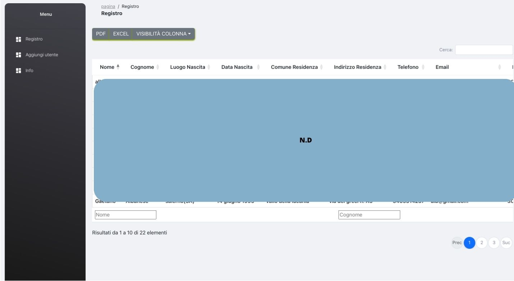
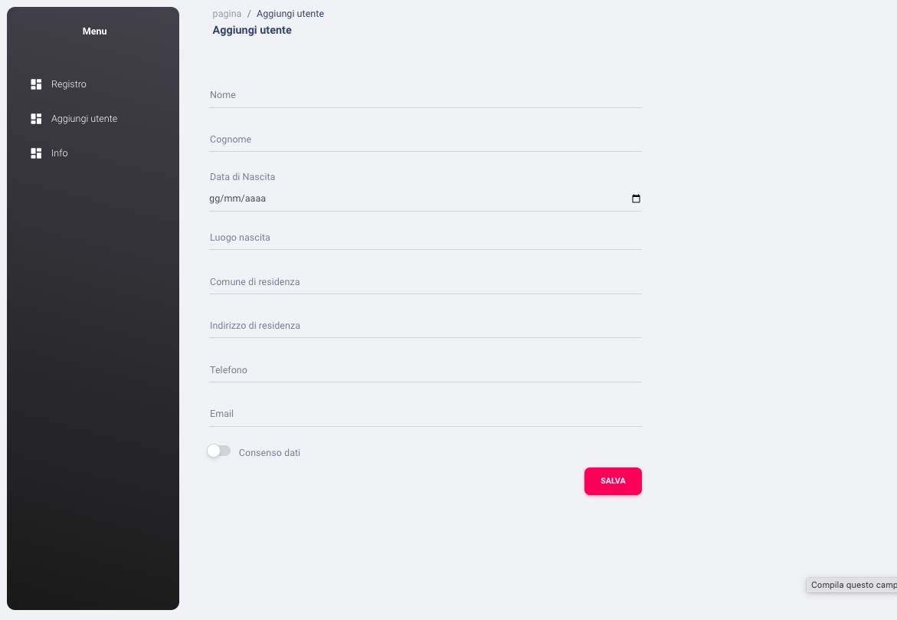

# member-register

Welcome to the "Register of Associates" repository! This open-source project aims to create a web application for managing a membership registry for an organization, association or club. The main goal is to provide a flexible and user-friendly system to track associate member information efficiently.

# Main Features
The "Register of Associates" project will offer several features to manage associates efficiently:

You can Add,remove, update amd read Associates: Administrators will be able to add new associates to the registry by providing details such as first name, last name, address, contact details, date of enrollment and other relevant information. In addition, it will be possible to update the existing information of the associates, allowing you to keep the register always up to date.
## Search and Filters:

The registry will include advanced search and filter capabilities to quickly locate specific Associates based on criteria such as name, date of enrollment, and more. it can be possible download CVS file or generate PDF.

this project is not finished yet, if you think it's interesting, don't hesitate to fork and modify this project.

# Registrazione dei membri
Benvenuti nel repository del "Registro degli Associati"! Questo progetto open-source ha l'obiettivo di creare un'applicazione web per gestire un registro di iscrizione per un'organizzazione, un'associazione o un club. L'obiettivo principale è fornire un sistema flessibile e user-friendly per tracciare efficientemente le informazioni degli associati.

# Principali Caratteristiche
Il progetto "Registro degli Associati" offrirà diverse funzionalità per gestire gli associati in modo efficiente:

È possibile aggiungere, rimuovere, aggiornare e leggere gli associati: Gli amministratori saranno in grado di aggiungere nuovi associati al registro fornendo dettagli come nome, cognome, indirizzo, recapiti, data di iscrizione e altre informazioni rilevanti. Inoltre, sarà possibile aggiornare le informazioni esistenti degli associati, consentendo di mantenere sempre aggiornato il registro.

# Ricerca e Filtro:
Il registro includerà funzionalità di ricerca avanzate e filtri per individuare rapidamente associati specifici in base a criteri come il nome, la data di iscrizione e altro ancora. Sarà possibile scaricare file CSV o generare PDF.

Questo progetto non è ancora finito, se pensi che sia interessante, non esitare a fare il fork e modificare questo progetto.

#Views

